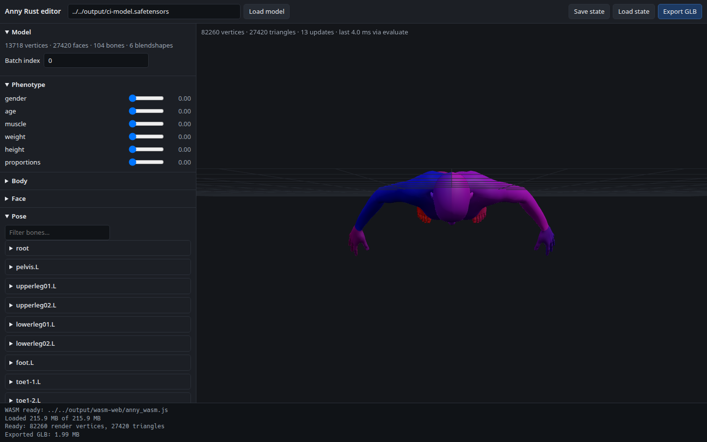

# Anny Rust editor

A browser front end for the native runtime, running the same Rust code through the `anny-wasm`
bindings. It is a reference implementation of what a character tool built on Anny looks like: the
panels are generated from the model, the viewport is driven by the runtime's own output, and nothing
about the character is hard-coded.



## What it does

| | |
|---|---|
| **3D preview** | A three.js viewport fed by `evaluate()`; smooth normals are recomputed from the faces on every update, so posed characters shade correctly. |
| **Phenotype / body / face** | One slider per label in `describe()` — `phenotype_labels`, `local_change_labels`, `facial_action_labels`. Counts on screen are the model's own lists, so a different prepared model rebuilds the panels. |
| **Posing** | The bone hierarchy from `bone_labels`/`bone_parents`, an X/Y/Z rotation per bone. Pose edits go through `pose_session()`, which re-poses the existing shape instead of re-evaluating it — the fast path the native side measures at 1.5–2×. |
| **Presets and randomisation** | Built-in presets match parameter labels by name and skip labels this model does not have; randomise is seeded, so a given seed always produces the same character. Anything you build can be saved as a state file, which is the general preset mechanism. |
| **Material and texture** | Base colour, roughness, metalness, wireframe. A PNG/JPEG applies as the base colour texture through the model's own `texture_coordinates`; the viewport duplicates face corners to carry the UVs. |
| **Animation preview** | Load a clip — the `frames` JSON `anny motion` reads — scrub it, play it, adjust speed. Frames are slerped between keyframes, so a three-frame demo reads as motion. |
| **Save / load** | The whole editor state (parameters, pose, material, camera, batch) as JSON, plus named presets in `localStorage`. |
| **GLB export** | `export_glb()` with the current parameters and material, skinned so the bones, joints and weights come out with it. |

## Running it

Build the WASM bindings as a web package, then serve the repository over HTTP:

```bash
cargo build --release --locked --target wasm32-unknown-unknown -p anny-wasm
wasm-bindgen target/wasm32-unknown-unknown/release/anny_wasm.wasm --target web --out-dir output/wasm-web

python3 -m http.server 8000     # any static server rooted at the repository
```

Then open <http://127.0.0.1:8000/examples/editor/index.html>.

A prepared model is required; by default the editor fetches `output/ci-model.safetensors`, which the
CLI prepares from the committed assets:

```bash
./target/release/anny prepare --assets data --output output/ci-model.safetensors
```

Both paths can be pointed elsewhere with query parameters, which is also how the qualification
harness drives it:

```
examples/editor/index.html?model=path/to/model.safetensors&wasm=output/wasm-web/anny_wasm.js
```

## Qualification

`examples/qualification/editor-smoke.cjs` drives the editor in a real Chromium through Playwright:
it checks that the panels match `describe()`, that a slider moves the mesh, that posing reports the
session path, that unposing restores the mesh, that randomise is seeded, that a state file
round-trips, that a texture reaches the material, that a clip animates, that the export is a real
GLB with a skin and is byte-reproducible, and that the viewport is actually drawing triangles.

```bash
node examples/qualification/editor-smoke.cjs output/ci-model.safetensors output/wasm-web/anny_wasm.js
```

It writes `output/editor-result.json`, `output/editor-export.glb` and a viewport screenshot,
`output/editor-viewport.png`. Set `CHROMIUM_PATH` to use an existing Chromium instead of Playwright's
own download.

## Browser GPU (WebGPU)

The same artifact exports the blendshape contraction for the GPU, so a page can run it on the browser's
own WebGPU adapter:

- `default_coefficients(bytes, batch)` — the default character's own coefficients, tiled `batch` times
  with the active rows rotated, so a batch carries real sparsity (~5% active) rather than a dense fill;
- `cpu_blendshapes(bytes, coefficients, batch)` — the f32 reference contraction;
- `gpu_blendshapes(bytes, coefficients, batch)` — the same contraction through WebGPU (async);
- `gpu_adapter_name()` — the adapter the last GPU call opened. Chrome redacts the name, so this reports
  the backend too, e.g. ` [BrowserWebGpu]`, which is what shows the call did go through WebGPU.

`examples/qualification/webgpu-smoke.cjs` compares the two in the page and records the result:

```bash
CHROMIUM_PATH=/usr/bin/google-chrome node examples/qualification/webgpu-smoke.cjs \
  output/wasm-web/anny_wasm.js output/ci-model.safetensors
```

It writes `output/webgpu-result.json`. Each one-shot call re-uploads the whole blendshape tensor, so this
path is qualified for agreement with the CPU, not for speed — see `docs/GPU.md`.

## Notes and limits

- Parameter ranges are a UI convention, not something the model reports: `describe()` names the
  blendshapes but not their bounds, so every slider spans 0..1 and the value is passed through
  unchanged.
- The unbuffered model payload is ~216 MB, so the first load is network- and parse-bound.
- Morph targets and animation curves are not part of the model format; `add-morph` and
  `add-animation` on `GltfDocument` are the supported way to add them to an exported GLB.
- Vendored `three.js` r169 (MIT) is in `vendor/`, so the editor needs no CDN.
